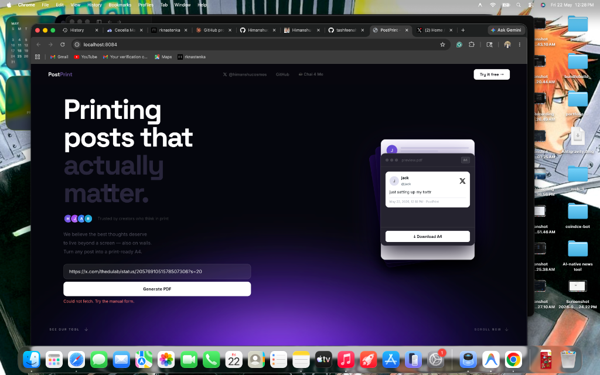
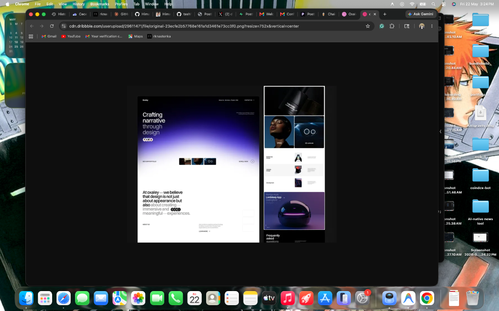
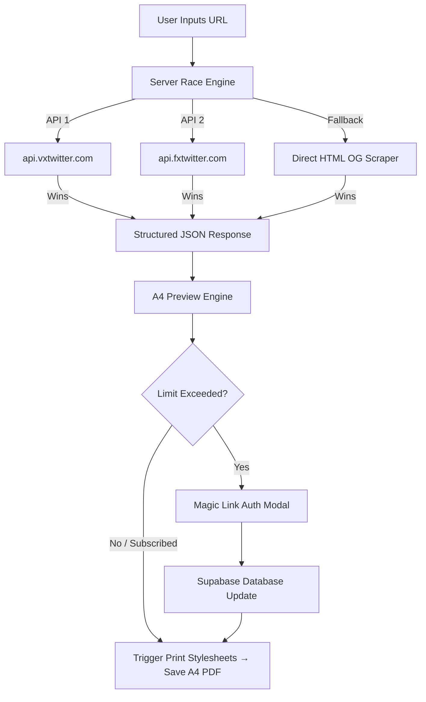

# PostPrint ✦

<p align="center">
  
</p>

<p align="center">
  <strong>Printing posts that actually matter.</strong><br>
  A minimalist, ultra-high-end editorial design tool that formats X/Twitter posts into beautiful, print-ready A4 sheets in one click.
</p>

<p align="center">
  <a href="https://x.com/himanshucosmos"><strong>✦ Twitter / X</strong></a> &bull;
  <a href="https://www.chai4.me/himanshucosmos"><strong>☕ Chai 4 Me</strong></a> &bull;
  <a href="https://github.com/Himanshucosmos"><strong>📁 GitHub</strong></a>
</p>

---

## ✦ The Philosophy

We live in a world of ephemeral digital scrolls. Words that shift perspective, spark ideas, or capture moments are swallowed by infinite feeds. **PostPrint** believes that the best thoughts deserve to live beyond a glass screen — framed on a wall, bound in a folder, or resting on a physical desk.

PostPrint bridges the gap between pixels and paper, converting digital social media posts into print-ready A4 layouts styled with uncompromising typographic rhythm.

---

## ✦ Key Features

### 1. Bulletproof Parallel Fetch Engine ⚡
*   **Race-Condition Fetching**: Concurrently queries `vxtwitter` and `fxtwitter` APIs in parallel to fetch tweet content with sub-second response times.
*   **Discordbot OG Fallback**: If standard API gateways are blocked, a third-layer parser replicates Discord's user-agent to scrape OG metadata directly from the source.
*   **Ultimate Resilience**: Fully isolated request paths. If all auto-fetch methods fail, a beautiful manual layout editor lets you design the sheet from scratch.

### 2. High-End Typographic System 🎨
*   **Aesthetic Balance**: Leverages **Syne** (tracked tight for strong titles), **Space Grotesk** (for architectural layout details), and **DM Sans** (for elegant readability).
*   **Atmospheric Accents**: Features a sleek obsidian dark mode background with a subtle dot grid texture and atmospheric radial purple orbs that glow like a brilliant white light.
*   **Interactive Previews**: A real-time, high-fidelity browser A4 viewport with zoom features (`-`, `+`, and scale indicators) that matches the paper print layout precisely.

### 3. Print-Ready A4 Engine 🖨️
*   **Three Layout Modes**:
    *   `Exact`: Prints the post at its natural pixel density.
    *   `Fill 1 Page`: Smart-scales the content to fill an entire physical A4 sheet beautifully—no matter how short or long the post.
    *   `Multi-page`: Flows extra-long posts continuously across multiple pages with proper page breaks and header anchors.
*   **Clean Print Stylesheets**: Automatically strips web interface elements (controls, grids, buttons, headers) during PDF printing and scales page elements to raw A4 metric standards (`210mm x 297mm`).

### 4. Supabase Auth & Metered Paywall 🔑
*   **Passwordless Magic Links**: Uses Supabase Go-True client-side SDK for seamless magic-link sign-ins.
*   **Metered Control**: Grants users `12` free downloads tracked natively. On expiration, prompts a gorgeous premium access gateway.
*   **UPI Subscription (₹1,000/mo)**: Integrated payment instructions allowing manual activation via dashboard or direct Supabase SQL execution.
*   **Graceful Degraded Mode**: If Supabase configuration is absent, the application silently falls back to a standalone offline `localStorage` configuration so users never hit breaking errors.

---

## ✦ Showcase

<p align="center">
  
  
</p>

---

## ✦ Architecture Overview

The system runs on a highly decoupled architecture utilizing a multi-threaded Python server, an optimized client-side JS print layout composer, and Supabase database handlers.



---

## ✦ Database Schema (Supabase)

To enable authentication, rate limiting, and subscriptions, set up the following schema in your Supabase project's SQL Editor:

```sql
-- Create a public profiles table connected to Supabase Auth
CREATE TABLE public.profiles (
  id         UUID REFERENCES auth.users(id) ON DELETE CASCADE PRIMARY KEY,
  email      TEXT,
  uses       INTEGER NOT NULL DEFAULT 0,
  paid_until TIMESTAMPTZ,
  created_at TIMESTAMPTZ NOT NULL DEFAULT NOW()
);

-- Enable Row Level Security (RLS)
ALTER TABLE public.profiles ENABLE ROW LEVEL SECURITY;

-- Set up secure access policies
CREATE POLICY "select_own"  ON public.profiles FOR SELECT USING (auth.uid() = id);
CREATE POLICY "insert_own"  ON public.profiles FOR INSERT WITH CHECK (auth.uid() = id);
CREATE POLICY "update_own"  ON public.profiles FOR UPDATE USING (auth.uid() = id);

-- Create a database trigger to auto-provision profile rows on sign-up
CREATE OR REPLACE FUNCTION public.handle_new_user()
RETURNS TRIGGER LANGUAGE plpgsql SECURITY DEFINER SET search_path = public AS $$
BEGIN
  INSERT INTO public.profiles (id, email, uses)
  VALUES (NEW.id, NEW.email, 0)
  ON CONFLICT (id) DO NOTHING;
  RETURN NEW;
END;
$$;

CREATE TRIGGER on_auth_user_created
  AFTER INSERT ON auth.users
  FOR EACH ROW EXECUTE FUNCTION public.handle_new_user();
```

---

## ✦ Getting Started

### Prerequisites
*   Python 3.x

### 1. Clone & Setup
```bash
git clone https://github.com/Himanshucosmos/postprint.git
cd postprint
```

### 2. Configure Environment Variables
Open `js/script.js` and set up your Supabase project keys and payment endpoints at the top of the file:

```javascript
const SUPABASE_URL   = 'https://your-supabase-id.supabase.co';
const SUPABASE_ANON  = 'your-anon-public-key';
const UPI_ID         = 'yourname@upi';
const CREATOR_EMAIL  = 'your@email.com';
const PRICE_INR      = 1000;
const FREE_LIMIT     = 12;
```

> [!TIP]
> If you leave `SUPABASE_URL` and `SUPABASE_ANON` empty, the system automatically runs in **Standalone Mode** using local browser storage! No cloud setup is required to test locally.

### 3. Run Locally
Launch the asynchronous Python backend server (which handles parallel fetch requests, local CORS, and live-reloading static directories):

```bash
python3 server.py
```

The server is now live at: **[http://localhost:8084](http://localhost:8084)**.

---

## ✦ Manual Subscriber Administration
When a user subscribes via UPI, run this query in your Supabase SQL Editor to grant subscription privileges (replaces with their specific account email):

```sql
UPDATE public.profiles
SET paid_until = NOW() + INTERVAL '30 days'
WHERE email = 'subscriber@example.com';
```

Or view your current subscriber status overview instantly:
```sql
SELECT email, uses, paid_until,
  CASE WHEN paid_until > NOW() THEN '✓ Active' ELSE '✗ Expired' END AS status
FROM profiles
ORDER BY paid_until DESC NULLS LAST;
```

---

## ✦ Technical Highlights
*   **Zero-Dependency Server**: Implemented entirely inside standard library modules (`http.server`, `urllib`, `threading`, `json`, `re`) for extreme portability.
*   **Fault-Tolerant CSS Print Layouts**: Resolves print viewport calculations using physical absolute `mm` coordinates and scales them seamlessly inside flex rows.
*   **Modern Web Aesthetics**: Implemented in fully hand-tailored vanilla CSS with elegant custom backdrop filters, gradient borders, and responsive design systems.

---

<p align="center">
  Made with love by <a href="https://x.com/himanshucosmos"><strong>Himanshu @himanshucosmos</strong></a> ✦
</p>
